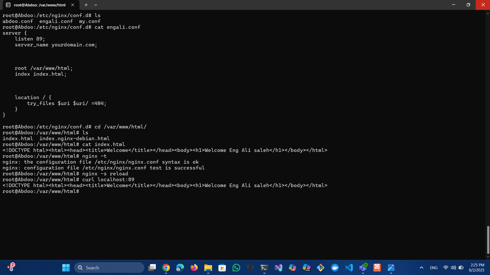

New conf abdoo.conf and cat it and the port is 85

Made a new html config and started nginx 

Start the web page 

New conf engali.conf and cat it and the port is 89
and changed the html file and started nginx

Running the web bage 

Processes and ports by netstat

We need to make localhost:88/my/ works so we made a my file in /var/www and 
made a index.html inside it and made my.conf inside conf.d

Then we run the command curl 

This the output of localhost:88/my/

